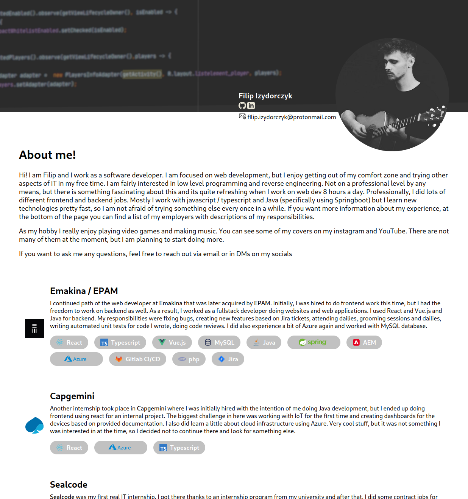

This is a project for my website. Vue.js is used so that I can create reusable components, but the website is supposed to be rendered to static html files.

**Commands:**

- `npm run start` - starts http server with current `dist`
- `npm run generate` - builds static files to `dist` directory

**Directory structure:**

- `/components` - is direcotry for reusable copmonents. It should contain no content, only parts of html with parameters to provide
- `/icons` - these are technically still components but all of these components have svg icon in them. This is an "interface" to embed svgs into the page with some parameters exposed to let you manipulate them
- `/sections` - these are also components but all of them should be rendered to html `<section>` tag. This is where you use components to create parts of the page and also where you insert text that needs to be displayed. Initially, I wanted to use `content` direcotry from nuxt but this turned out to be not flexible enough and since this project is small, components like this will be just enough. If your page code is getting too long you can create section to make it more readeable.
- `/pages` - This file is allowed to use components and sections to create final page. All of these files wil be transformed into route on a website. Eg. `index.vue` -> `/`
- `/static` - all of the files I know a website will need to show content like fonts, icons, images, static css

# Resources

Some logos comes from svgrepo (these have a comment in component file) and other were searched on [seek logo](https://seeklogo.com/), [wikimedia](https://commons.wikimedia.org), [remixicons](https://remixicon.com/) or on companies websites.

# Preview

